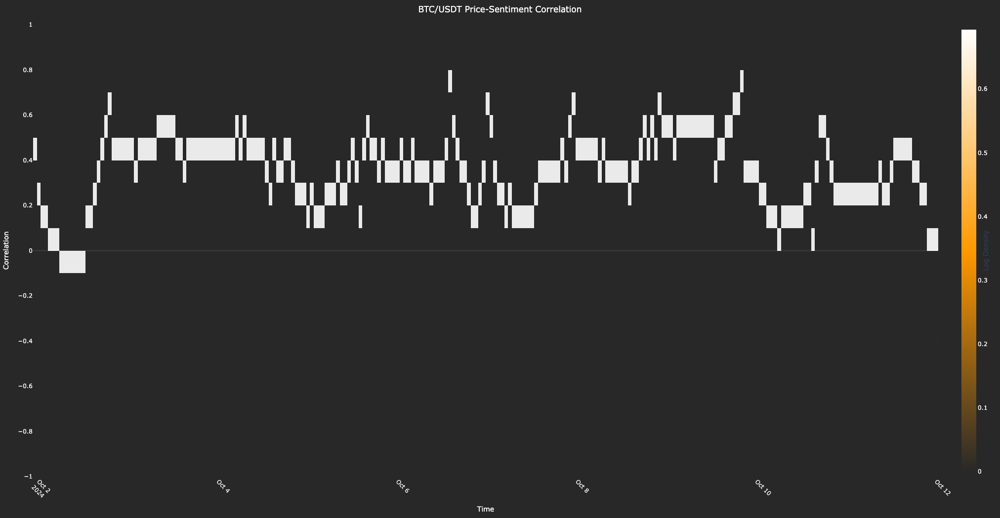
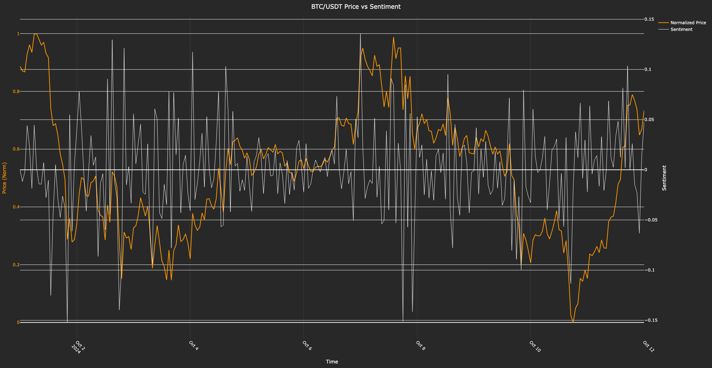

# crypto_btc_sentiment

- This project analyzes the relationship between **BTC/USDT** price movements and simulated market sentiment.
- It fetches hourly price data, generates a synthetic sentiment signal, and visualizes the correlation as a heatmap and a dual-axis time series.

---

## Files
- `crypto_sentiment.py`: Main script for fetching price data, simulating sentiment, and generating visualizations.
- No external dataset required; data is fetched live from Binance via `ccxt`.
- `heatmap.png`: Correlation heatmap of price and sentiment - Colors: `#FF9900` (BTC) gradient.
- `timeseries.png`: Dual-axis time series of normalized price and sentiment - Colors: `#FF9900` (price), `white` (sentiment).

---

## Libraries Used
- `numpy`
- `pandas`
- `plotly.graph_objects`
- `ccxt`
- `datetime`

---

## Timeframe
- **Input**: Hourly price data from **2024-10-01T00:00:00Z** to **2024-10-12T00:00:00Z** (configurable in code).
- **Output**: Correlation heatmap and time series over this period.

---

## Features
- Fetches hourly BTC/USDT price data from Binance.
- Simulates sentiment using a hyperbolic tangent function based on price returns.
- Calculates rolling 24-hour correlation between price and sentiment.
- Visualizes correlation as a heatmap and overlays normalized price with sentiment in a time series.

---

## Screenshots

